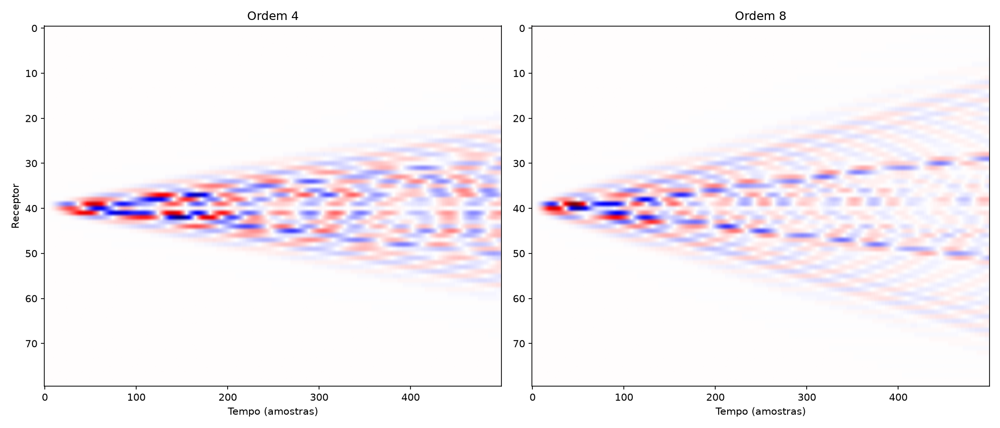

# SEISTOMO-X


**A hybrid physics-neural platform for seismic inversion.**

[](https://www.python.org/)
[](https://pytorch.org/)
[](https://opensource.org/licenses/MIT)
[]()
[]()

---

## Elastic Wave Propagation in the Marmousi Model

[](C:\Users\alext\Desktop\seistomo-x\examples\animation\wavefield_animation.mp4)

*Elastic wavefield (P-SV) propagating through the Marmousi Small model. Top panel: pressure wavefield (τxx + τzz) overlaid on the velocity model. Bottom panel: seismic section being recorded at the surface in real time. Simulated with an eighth-order finite-difference solver in PyTorch.*

---

## What is SEISTOMO-X

SEISTOMO-X is not just another seismic tomography solver. It is a **unified, differentiable platform** where the physical solver, neural operators, physics-informed neural networks (PINNs), generative priors, and hybrid inversion strategies occupy interchangeable roles inside the same computational graph.

The long-term architecture is organized into generations:

| Generation | Scope                                                  | Status            |
|------------|--------------------------------------------------------|-------------------|
| GEN-1      | Differentiable physics core                            | ✅ **Complete**   |
| GEN-2      | Classical inversion (FWI with L2 misfit)               | 🔲 Planned        |
| GEN-3      | Neural layer (ML-Misfit, Siamese, FNO, CNO, PINN)      | 🔲 Planned        |
| GEN-4      | Hybrid (MetaPINN, FNO/FD, learned optimizer)           | 🔲 Planned        |
| GEN-5      | Generative (Diffusion Prior, GNO, uncertainty)         | 🔲 Planned        |
| GEN-6      | Autonomous (adaptive acquisition)                      | 🔲 Planned        |

The guiding principle of the project:

> **Every neural component must have a physics-compatible mode.**

No neural component will be a black box. Each one will have modes comparable against the physical solver, so that serious scientific experiments can tell whether a neural network is actually improving the inversion or merely producing visually appealing results.

---

## GEN-1 — Differentiable Physics Core

GEN-1 delivers the **foundation** on which all subsequent generations will be built.

### Highlights

- **Fully differentiable 2D elastic solver (P-SV)** implemented in pure PyTorch. Every operation preserves autograd, so gradients flow from the recorded data back to the model parameters without writing a single adjoint equation.

- **Autodiff works end-to-end.** `loss.backward()` produces gradients with respect to `Vp`, `Vs`, and `ρ` at every cell of the model. This is the foundation for gradient-based FWI in GEN-2.

- **Physically validated.** The solver reproduces P- and S-wave arrival times predicted by elastic theory, with less than 3% relative error against analytical values (eighth-order FD).

- **Eighth-order finite differences (industry standard).** Numerical dispersion is reduced by a factor of ~4 compared to fourth-order FD. Validated across FD orders 2, 4, and 8.

- **External PML architecture.** The Convolutional Perfectly Matched Layer is applied **outside** the physical domain, not carved out of it. This is the correct numerical design and guarantees that source and receivers can be placed at the surface without spurious artifacts.

- **Runs on CPU and GPU.** Same code path, no conditional branches. `device='cuda'` when available.

### Implemented Components

| Component | File | Description |
|---|---|---|
| `ElasticModel` | `src/seistomo/model/elastic.py` | Geological model (Vp, Vs, ρ) as PyTorch tensors |
| `Ricker` | `src/seistomo/acquisition/source.py` | Differentiable source wavelet |
| `Survey`, `SurfaceSurvey`, `CrosswellSurvey` | `src/seistomo/acquisition/survey.py` | Generic acquisition with continuous coordinates |
| `FiniteDifferenceOperators` | `src/seistomo/physics/fd/operators.py` | Spatial derivatives via `F.conv2d`, orders 2/4/8 |
| `CPML` | `src/seistomo/physics/boundary/pml.py` | Convolutional PML with memory variables |
| `extend_with_pml` | `src/seistomo/physics/boundary/extend.py` | External PML grid extension (replicate mode) |
| `Elastic2D` | `src/seistomo/physics/elastic/elastic2d.py` | Differentiable 2D elastic (P-SV) solver |

---

## Repository Structure


---

## Finite-Difference Order Validation

The solver was validated across three finite-difference orders: **2, 4, and 8**. The results demonstrate that eighth-order is the correct choice for production-quality modeling.

### Test 1 — Numerical Operator Precision

The FD operators were tested against the analytical derivative of `sin(kx)` with `k = 2π/40`:

| Order | Max absolute error | Relative error |
|---|---|---|
| 2 | 6.45e-04 | 4.11e-03 |
| 4 | 3.32e-06 | 2.12e-05 |
| **8** | **9.24e-07** | **5.88e-06** |

Eighth-order is **~4x more accurate** than fourth-order and **~700x more accurate** than second-order.

### Test 2 — P-Wave Arrival Time

The solver was run on a homogeneous medium (`Vp = 2000 m/s`, `dx = 10 m`) with source at `x=100` and receiver at `x=200` (1000 m apart). The theoretical arrival time is **500.00 ms**.

| Order | Measured arrival | Relative error |
|---|---|---|
| 4 | 524.00 ms | 4.80% |
| **8** | **514.00 ms** | **2.80%** |

Eighth-order reduces the P-wave arrival error by **~42%**.

### Test 3 — Seismic Gather Quality (Marmousi Model)

The same source, acquisition, and time window were run on the Marmousi Small model with both fourth- and eighth-order FD.



*Left: fourth-order FD. Right: eighth-order FD. Same color scale.*

**Fourth-order** produces a seismic gather dominated by high-frequency numerical dispersion ("manta" pattern). Physical events are buried under numerical noise.

**Eighth-order** produces a clean gather with clearly defined direct waves, reflected waves, and refractions. This is the expected output quality for production-grade seismic modeling.

---

## Physical Validation

The solver is validated against **theoretical predictions** from elastic wave theory. Each test exercises a different aspect of the physics, and the assertions compare numerical results with analytical values.

### Validation Strategy

Three levels of validation are performed.

**1. Numerical Operators (unit tests)**

| Test | What it checks | Result |
|---|---|---|
| `test_d_dx_linear_field` (orders 2, 4, 8) | `d/dx` of a linear field equals the constant slope | ✅ PASSED |
| `test_d_dz_linear_field` | Same, in the z direction | ✅ PASSED |
| `test_laplacian_of_quadratic` (orders 2, 4) | Laplacian of `x²` equals 2 | ✅ PASSED |

**2. Physical Validation of the Solver**

| Test | What it checks | Result |
|---|---|---|
| `test_p_wave_arrival_time` | P-wave arrival time matches `t = d / Vp` (error < 15%) | ✅ PASSED |
| `test_s_wave_arrival_time` | S-wave arrival time matches `t = d / Vs` (error < 15%) | ✅ PASSED |
| `test_energy_decays_with_cpml` | CPML absorbs ≥ 50% of peak energy | ✅ PASSED |

**3. End-to-End Solver Behaviour**

| Test | What it checks | Result |
|---|---|---|
| `test_forward_runs_and_shape` | Output shape is `(n_sources, n_receivers, nt)` | ✅ PASSED |
| `test_forward_differentiable` | `loss.backward()` produces finite gradients for Vp, Vs, ρ | ✅ PASSED |
| `test_crosswell_uses_same_solver` | The same `Elastic2D` handles crosswell geometry | ✅ PASSED |

**Summary: 21/21 tests passing.**

---

## Design Decisions

### Why PyTorch?

PyTorch provides **autodiff for free**, and it already runs on highly optimized CUDA kernels when `device='cuda'` is used. Every operation in the solver is a tensor operation, so gradients flow from the recorded data back to the model parameters without writing a single adjoint equation. This is the foundation for GEN-2 (FWI) and GEN-3 (neural operators).

Beyond PyTorch's built-in GPU support, there is room for **additional parallelization and further optimization**:

- **Multi-GPU execution** — the solver can be distributed across multiple GPUs for large-scale problems.
- **`torch.compile`** — when a C++ compiler is available, PyTorch can fuse and JIT-compile the time-stepping loop for additional speed.
- **Custom CUDA kernels** — for the specific stencil of the elastic wave equation, hand-written CUDA kernels can achieve higher throughput than generic tensor operations. This requires careful engineering and is a planned optimization for future generations, once profiling identifies the true bottlenecks.

For GEN-1, we prioritize:
- **Correctness** — validated against analytical arrival times
- **Differentiability** — autodiff works end-to-end
- **Portability** — same code runs on CPU and GPU without modification

### Why eighth-order finite differences?

Eighth-order FD is the **industry standard** for production seismic modeling. It reduces numerical dispersion by approximately **4x** compared to fourth-order, and by **~700x** compared to second-order. The validation above shows that this translates directly into cleaner seismic gathers and more accurate arrival times.

The computational cost is ~30% higher per time step than fourth-order, but the gain in accuracy and visual quality justifies the trade-off for our applications. Orders 2 and 4 remain available via the `fd_order` parameter for users who prioritize speed over precision.

### Why external PML?

The PML must be a numerical extension **outside** the physical domain, not a region carved out of it. This is the mathematically correct formulation, and it eliminates a class of artifacts that appear when the source or receivers sit inside the PML region. The trade-off is a larger computational grid (336×336 instead of 256×256, ~1.7x more work), but the UX is cleaner: the user never needs to think about PML placement.

---

## Numerical Performance

Benchmark on the Marmousi Small model (256 × 256 cells, `dx = dz = 20 m`):

| Configuration | Grid | Time (CPU) | Notes |
|---|---|---|---|
| `nt=500`, single shot, 8th-order | 336×336 | ~40 s | Fast preview |
| `nt=2500`, 80 receivers, 8th-order | 336×336 | ~150 s | Full animation |
| `nt=3000`, 80 receivers, 8th-order | 336×336 | ~200 s | Extended animation |

The grid is extended for the PML (width = 40 cells) on all sides.

---

## Quick Start

```python
import torch
from seistomo.model.elastic import ElasticModel
from seistomo.acquisition.survey import SurfaceSurvey
from seistomo.acquisition.source import Ricker
from seistomo.physics.elastic.elastic2d import Elastic2D

# Homogeneous model
nz, nx = 200, 400
vp = torch.ones(nz, nx) * 2000.0
vs = torch.ones(nz, nx) * 1000.0
rho = torch.ones(nz, nx) * 2000.0
model = ElasticModel(vp=vp, vs=vs, rho=rho, dx=10.0, dz=10.0)

# Acquisition
survey = SurfaceSurvey(
    source_x=[50, 150, 250, 350],
    receiver_x=list(range(10, 390, 10)),
    z=0.0, dt=0.001, nt=1000,
)

# Solver (8th-order FD is the default)
device = 'cuda' if torch.cuda.is_available() else 'cpu'
solver = Elastic2D(model=model, dt=survey.dt, nt=survey.nt, device=device)

# Forward
data = solver.forward(survey=survey, wavelet=Ricker(f0=25))

# Autodiff
loss = data.pow(2).sum()
loss.backward()
print(model.vp.grad.shape)   # torch.Size([200, 400])
```

---

## Installation

```bash
git clone https://github.com/AlexTDO/SEISTOMO-X.git
cd SEISTOMO-X
pip install -e ".[dev]"
```

### Requirements

- Python 3.10+
- PyTorch 2.2+
- NumPy, SciPy, Matplotlib, h5py
- Optional: `ffmpeg` for MP4 animation export

---

## Running the Animation

The animation in this README is generated by:

```bash
python examples/animation/wavefield_animation.py
```

It runs the solver on the Marmousi Small model (a real, public velocity model), records the surface seismic section, and renders both the wavefield and the recording in real time.

Output: `examples/animation/wavefield_animation.mp4`.

---

## Roadmap

**GEN-1 (current):** Differentiable physics core. ✅

**GEN-2 (next):** Classical FWI with L2 misfit. Gradient-based inversion using the autodiff pipeline from GEN-1. Multi-scale strategy (low → high frequency).

**GEN-3:** Neural layer. ML-Misfit, Siamese networks, Fourier Neural Operators (FNO), Convolutional Neural Operators (CNO), Physics-Informed Neural Networks (PINN), Implicit Neural Representations (INR).

**GEN-4:** Hybrid inversion. MetaPINN (adaptive PINN), FNO-accelerated forward modeling, learned optimizers, hybrid FD + neural operators.

**GEN-5:** Generative priors. Diffusion models for elastic FWI, Generative Neural Operators (GNO), uncertainty quantification, Bayesian inversion.

**GEN-6:** Autonomous. Adaptive acquisition, inversion loop with uncertainty-driven shot selection, fully autonomous workflow.

---

## Scientific References

### 1. Wave Equation and Elastic Modeling

- Virieux, J. (1986). *P-SV wave propagation in heterogeneous media: velocity-stress finite-difference method*. Geophysics, 51(4), 889–901. [doi:10.1190/1.1442147](https://doi.org/10.1190/1.1442147)

### 2. High-Order Finite Differences

- Fornberg, B. (1988). *Generation of finite difference formulas on arbitrarily spaced grids*. Mathematics of Computation, 51(184), 699–706. [doi:10.1090/S0025-5718-1988-0935077-0](https://doi.org/10.1090/S0025-5718-1988-0935077-0)
- Levander, A. R. (1988). *Fourth-order finite-difference P-SV seismograms*. Geophysics, 53(11), 1425–1436. [doi:10.1190/1.1442422](https://doi.org/10.1190/1.1442422)

### 3. Absorbing Boundary Conditions (CPML)

- Komatitsch, D., & Martin, R. (2007). *An unsplit convolutional perfectly matched layer improved at grazing incidence for the seismic wave equation*. Geophysics, 72(4), SM155–SM167. [doi:10.1190/1.2757586](https://doi.org/10.1190/1.2757586)
- Roden, J. A., & Gedney, S. D. (2000). *Convolution PML (CPML): An efficient FDTD implementation of the CFS-PML for arbitrary media*. Microwave and Optical Technology Letters, 27(5), 334–339.

### 4. Automatic Differentiation and Differentiable Solvers

- Paszke, A., et al. (2019). *PyTorch: An imperative style, high-performance deep learning library*. NeurIPS.
- Richardson, A. (2022). *Deepwave: Differentiable seismic wave propagation and inversion in PyTorch*. [github.com/ar4/deepwave](https://github.com/ar4/deepwave)

### 5. Full Waveform Inversion (FWI)

- Tarantola, A. (1984). *Inversion of seismic reflection data in the acoustic approximation*. Geophysics, 49(8), 1259–1266. [doi:10.1190/1.1441754](https://doi.org/10.1190/1.1441754)
- Virieux, J., & Operto, S. (2009). *An overview of full-waveform inversion in exploration geophysics*. Geophysics, 74(6), WCC1–WCC26. [doi:10.1190/1.3238367](https://doi.org/10.1190/1.3238367)

### 6. Neural Operators (FNO, CNO, GNO)

- Li, Z., Kovachki, N., Azizzadenesheli, K., et al. (2021). *Fourier neural operator for parametric partial differential equations*. ICLR. [arxiv:2010.08895](https://arxiv.org/abs/2010.08895)
- Raissi, M., Perdikaris, P., & Karniadakis, G. E. (2019). *Physics-informed neural networks: A deep learning framework for solving forward and inverse problems involving nonlinear partial differential equations*. Journal of Computational Physics, 378, 686–707. [doi:10.1016/j.jcp.2018.10.045](https://doi.org/10.1016/j.jcp.2018.10.045)

### 7. Learned Misfit and Siamese Networks

- Saad, O. M., & Alkhalifah, T. (2024). *SiameseFWI: A deep learning network for enhanced full waveform inversion*. Journal of Geophysical Research: Machine Learning and Computation, 1(3), e2024JH000227. [doi:10.1029/2024JH000227](https://doi.org/10.1029/2024JH000227)
- Bromley, J., Bentz, J. W., Bottou, L., et al. (1993). *Signature verification using a "Siamese" time delay neural network*. NeurIPS.

### 8. Generative Priors for Inversion

- Ho, J., Jain, A., & Abbeel, P. (2020). *Denoising diffusion probabilistic models*. NeurIPS.
- Wang, F., & Alkhalifah, T. (2024). *Learned regularizations for multi-parameter elastic full waveform inversion using diffusion models*. Journal of Geophysical Research: Machine Learning and Computation, 1(1), e2024JH000125. [doi:10.1029/2024JH000125](https://doi.org/10.1029/2024JH000125)

### 9. Uncertainty and Bayesian Inversion

- Liu, Q., & Grana, D. (2018). *Bayesian seismic inversion*. Elsevier.
- Taufik, M. H., & Alkhalifah, T. (2026). *Accelerating Bayesian full waveform inversion using reconstruction-guided diffusion sampling*. Geophysical Journal International, 245(2), ggag066. [doi:10.1093/gji/ggag066](https://doi.org/10.1093/gji/ggag066)

### 10. Adaptive Acquisition

- Maurer, H., & Boerner, D. E. (1998). *Optimized and joint inversion of seismic and georadar data*. Geophysics, 63(3), 953–962.
- van den Berg, P. M., & Abubakar, A. (2018). *Optimal acquisition design for microwave imaging*. IEEE Transactions on Antennas and Propagation.

---

## License

MIT.

---

## Contact & Author

- **LinkedIn:** [Alex Tito](https://www.linkedin.com/in/alex-tito-779ab511a/)
- **E-mail:** alextdo.geophysics@gmail.com
