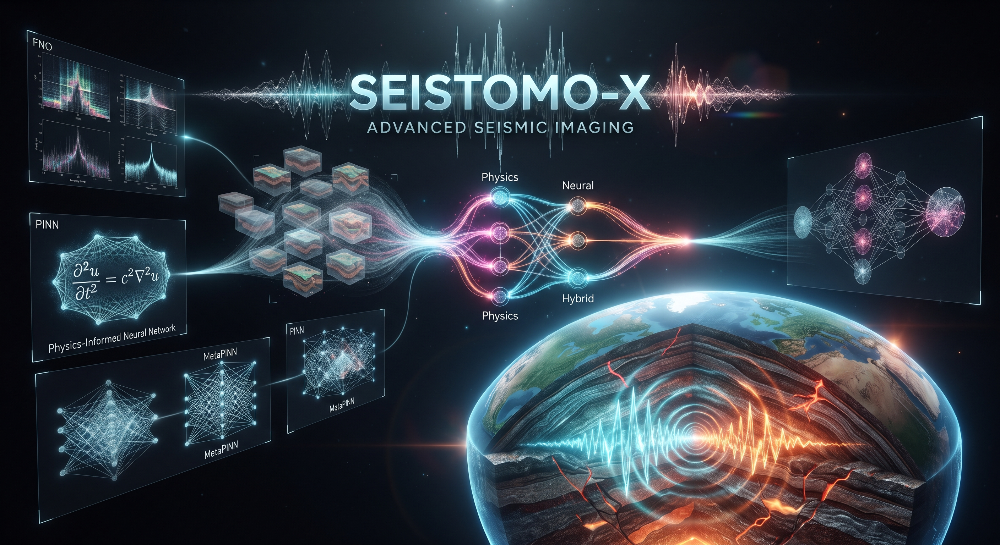
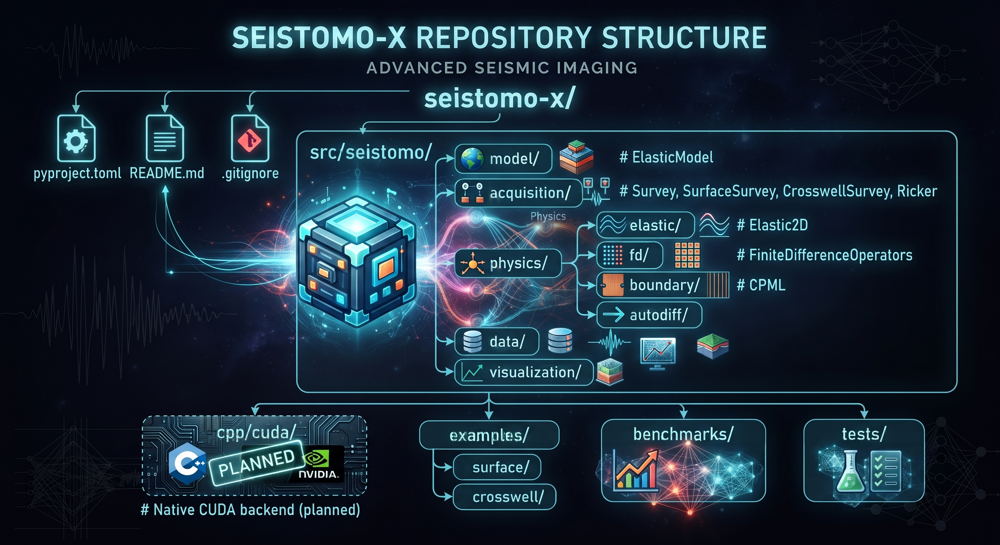

markdown
# SEISTOMO-X



A hybrid physics-neural platform for seismic inversion.
---

## Vision

`seistomo-x` is not just another seismic tomography solver. It is a
**unified platform** where the physical solver, neural operators, PINNs,
generative models, and geological priors occupy interchangeable roles
inside the same differentiable computational graph.

The long-term architecture is organized into generations:

| Generation | Scope                                                  | Status              |
|------------|--------------------------------------------------------|---------------------|
| GEN-1      | Differentiable physics core                            | 🚧 In progress      |
| GEN-2      | Classical inversion (FWI with L2 misfit)               | 🔲 Planned          |
| GEN-3      | Neural layer (ML-Misfit, Siamese, FNO, CNO, PINN)      | 🔲 Planned          |
| GEN-4      | Hybrid (MetaPINN, FNO/FD, learned optimizer)           | 🔲 Planned          |
| GEN-5      | Generative (Diffusion Prior, GNO, uncertainty)         | 🔲 Planned          |
| GEN-6      | Autonomous (adaptive acquisition)                      | 🔲 Planned          |

The principle guiding the entire project:

> **Every neural component must have a physics-compatible mode.**

No neural component will be a black box. Each one will have modes
comparable against the physical solver, so that serious scientific
experiments can tell whether a neural network is actually improving
the inversion or merely producing visually appealing results.

---

## Current State — GEN-1

GEN-1 delivers the **physical foundation** on which all subsequent
generations will be built. It contains:

### Implemented components

- **`ElasticModel`** — geological model (Vp, Vs, ρ) as PyTorch tensors,
  guaranteeing autodiff from the first line.
- **`Ricker`** — differentiable source wavelet.
- **`Survey` / `SurfaceSurvey` / `CrosswellSurvey`** — generic acquisition,
  represented by continuous coordinates, so the solver never needs to
  know whether the geometry is surface or crosswell.
- **`FiniteDifferenceOperators`** — spatial derivatives via `F.conv2d`,
  supporting orders 2, 4, and 8. Optimized for GPU.
- **`CPML`** — a real Convolutional Perfectly Matched Layer, with memory
  variables, absorbing waves at any angle and frequency.
- **`Elastic2D`** — differentiable 2D elastic (P-SV) solver, with
  bilinear interpolation for sources and receivers at arbitrary
  coordinates, and `torch.compile` for performance.

### What already works

- Forward modeling in Surface geometry
- Forward modeling in Crosswell geometry (same solver)
- Autodiff: `loss.backward()` produces `Vp.grad`, `Vs.grad`, `rho.grad`
- Runs on CPU and CUDA without modification
- CPML absorbing waves at the boundaries

### What is not ready yet

- Native CUDA backend (`cpp/cuda/`) — planned
- Unit tests — in progress
- Performance benchmarks — in progress
- Physical validation (P and S arrival times) — in progress


## Repository Structure



## Installation

```bash
git clone [https://github.com/](https://github.com/)<your-user>/seistomo-x.git
cd seistomo-x
pip install -e ".[dev]"

```

## Quick Start

```python
import torch
from seistomo.model.elastic import ElasticModel
from seistomo.acquisition.survey import SurfaceSurvey
from seistomo.acquisition.source import Ricker
from seistomo.physics.elastic.elastic2d import Elastic2D

# Homogeneous model
nz, nx = 200, 400
vp = torch.ones(nz, nx) * 2000.0
vs = torch.ones(nz, nx) * 1000.0
rho = torch.ones(nz, nx) * 2000.0
model = ElasticModel(vp=vp, vs=vs, rho=rho, dx=10.0, dz=10.0)

# Acquisition
survey = SurfaceSurvey(
    source_x=[50, 150, 250, 350],
    receiver_x=list(range(10, 390, 10)),
    z=0.0, dt=0.001, nt=1000,
)

# Solver
device = 'cuda' if torch.cuda.is_available() else 'cpu'
solver = Elastic2D(model=model, dt=survey.dt, nt=survey.nt, device=device)

# Forward
data = solver.forward(survey=survey, wavelet=Ricker(f0=25))

# Autodiff
loss = data.pow(2).sum()
loss.backward()
print(model.vp.grad.shape)  # torch.Size([200, 400])

```

---

## Scientific References

This project rests on a solid body of literature in computational
geophysics, deep learning, and seismic inversion. The references below
underpin both the mathematics of the solver and the long-term
architecture.

1. **Wave Equation and Elastic Modeling**
* Virieux, J. (1986). P-SV wave propagation in heterogeneous media: velocity-stress finite-difference method. *Geophysics*, 51(4), 889–901. doi:10.1190/1.1442147


2. **High-Order Finite Differences**
* Fornberg, B. (1988). Generation of finite difference formulas on arbitrarily spaced grids. *Mathematics of Computation*, 51(184), 699–706. doi:10.1090/S0025-5718-1988-0935077-0
* Levander, A. R. (1988). Fourth-order finite-difference P-SV seismograms. *Geophysics*, 53(11), 1425–1436. doi:10.1190/1.1442422


3. **Absorbing Boundary Conditions (CPML)**
* Komatitsch, D., & Martin, R. (2007). An unsplit convolutional perfectly matched layer improved at grazing incidence for the seismic wave equation. *Geophysics*, 72(4), SM155–SM167. doi:10.1190/1.2757586
* Roden, J. A., & Gedney, S. D. (2000). Convolution PML (CPML): An efficient FDTD implementation of the CFS-PML for arbitrary media. *Microwave and Optical Technology Letters*, 27(5), 334–339.


4. **Automatic Differentiation and Differentiable Solvers**
* Paszke, A., et al. (2019). PyTorch: An imperative style, high-performance deep learning library. *NeurIPS*.
* Richardson, A. (2022). Deepwave: Differentiable seismic wave propagation and inversion in PyTorch. `github.com/ar4/deepwave`


5. **Full Waveform Inversion (FWI)**
* Tarantola, A. (1984). Inversion of seismic reflection data in the acoustic approximation. *Geophysics*, 49(8), 1259–1266. doi:10.1190/1.1441754
* Virieux, J., & Operto, S. (2009). An overview of full-waveform inversion in exploration geophysics. *Geophysics*, 74(6), WCC1–WCC26. doi:10.1190/1.3238367


6. **Neural Operators (FNO, CNO, GNO)**
* Li, Z., Kovachki, N., Azizzadenesheli, K., et al. (2021). Fourier neural operator for parametric partial differential equations. *ICLR*. `arxiv:2010.08895`
* Raissi, M., Perdikaris, P., & Karniadakis, G. E. (2019). Physics-informed neural networks: A deep learning framework for solving forward and inverse problems involving nonlinear partial differential equations. *Journal of Computational Physics*, 378, 686–707. doi:10.1016/j.jcp.2018.10.045


7. **Learned Misfit and Siamese Networks**
* Saad, O. M., & Alkhalifah, T. (2024). SiameseFWI: A deep learning network for enhanced full waveform inversion. *Journal of Geophysical Research: Machine Learning and Computation*, 1(3), e2024JH000227. doi:10.1029/2024JH000227
* Bromley, J., Bentz, J. W., Bottou, L., et al. (1993). Signature verification using a "Siamese" time delay neural network. *NeurIPS*.


8. **Generative Priors for Inversion**
* Ho, J., Jain, A., & Abbeel, P. (2020). Denoising diffusion probabilistic models. *NeurIPS*.
* Wang, F., & Alkhalifah, T. (2024). Learned regularizations for multi-parameter elastic full waveform inversion using diffusion models. *Journal of Geophysical Research: Machine Learning and Computation*, 1(1), e2024JH000125. doi:10.1029/2024JH000125


9. **Uncertainty and Bayesian Inversion**
* Liu, Q., & Grana, D. (2018). Bayesian seismic inversion. *Elsevier*.
* Taufik, M. H., & Alkhalifah, T. (2026). Accelerating Bayesian full waveform inversion using reconstruction-guided diffusion sampling. *Geophysical Journal International*, 245(2), ggag066. doi:10.1093/gji/ggag066


10. **Adaptive Acquisition**
* Maurer, H., & Boerner, D. E. (1998). Optimized and joint inversion of seismic and georadar data. *Geophysics*, 63(3), 953–962.
* van den Berg, P. M., & Abubakar, A. (2018). Optimal acquisition design for microwave imaging. *IEEE Transactions on Antennas and Propagation*.


---

## License

MIT.

---

## Contact & Author

* **LinkedIn:** [Alex Tito](https://www.linkedin.com/in/alex-tito-779ab511a/?utm_source=gemini)
* **E-mail:** alextdo.geophysics@gmail.com


